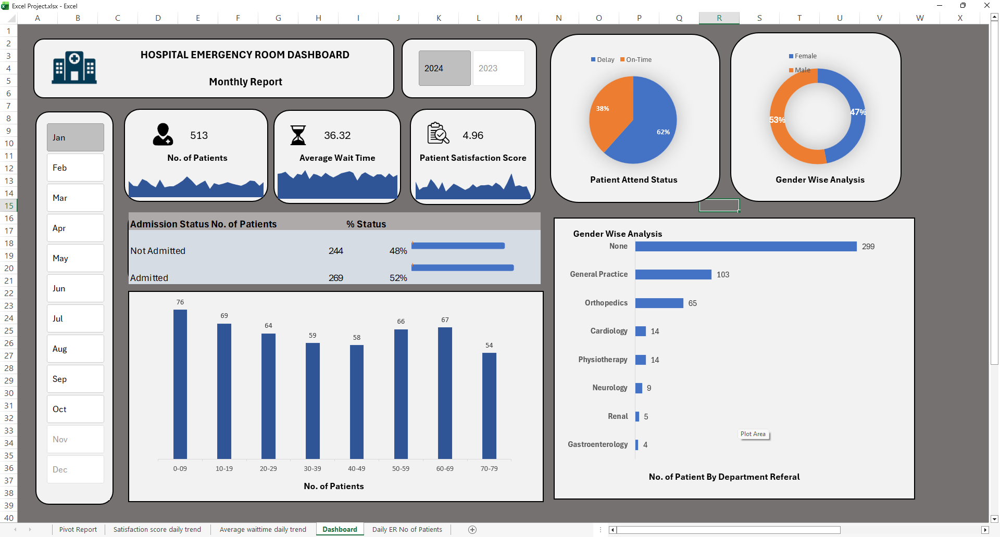

# Hospital-Emergency-Room-Dashboard

# 🏥 End-to-End Hospital Emergency Room Dashboard (Excel)

## 📌 Project Overview

This project demonstrates an end-to-end data analytics workflow using Microsoft Excel to analyze Hospital Emergency Room performance.

The dashboard provides interactive insights into patient volume, wait times, satisfaction scores, admissions, demographics, and department referrals.

---

## 🎯 Business Objective

To analyze Emergency Room data and identify:

- Patient visit trends
- Average waiting time patterns
- Patient satisfaction levels
- Admission rate analysis
- Timeliness of service (within 30 minutes)
- Gender distribution
- Age group distribution
- Department referral trends

---

## 🧠 Project Workflow

### 1️⃣ KPI Requirement Definition
Defined key performance indicators:
- Total Patients
- Average Wait Time
- Patient Satisfaction Score

### 2️⃣ Data Preparation
- Cleaned raw data
- Created calculated columns
- Built calendar table for proper date analysis

### 3️⃣ Pivot Analysis
- Built pivot tables for aggregation
- Used distinct count for patient ID
- Calculated admission percentages
- Analyzed daily trends

### 4️⃣ Visualization
- Created interactive charts:
  - Admission Status
  - Age Distribution
  - Gender Analysis
  - Department Referrals
  - Timeliness (Delay vs On-Time)

### 5️⃣ Interactive Dashboard
- Implemented slicers (Year & Month)
- Designed KPI cards with sparklines
- Built a fully dynamic dashboard

---

## 📊 Key Insights

- 513 total patients analyzed
- 52% admission rate
- Average wait time: 36.32 minutes
- Higher patient volume observed in specific age groups
- Department referrals concentrated in General Practice & Orthopedics
- On-time patient percentage significantly impacts satisfaction trends

---

## 🛠 Tools & Skills Used

- Microsoft Excel
- Pivot Tables & Pivot Charts
- Slicers
- Distinct Count
- Conditional Formatting
- Sparklines
- Calendar Table Creation
- Dashboard Design

---

## 📷 Dashboard Preview

---

## 👩‍💻 Author

Supreet Kaur  
Aspiring Data Analyst  
Open to Entry-Level Data Analyst Opportunities
